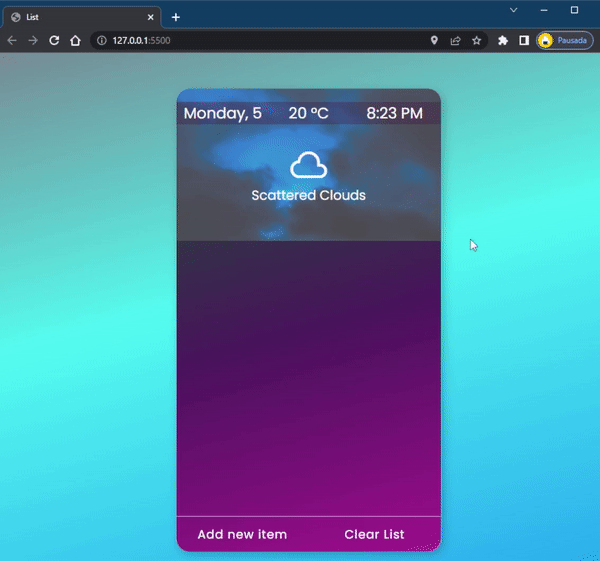

<h1>Simple To-Do List</h1>
This is the first complete app I did by myself and amazingly it works! :grinning:   
It is very simple, of course. At first the idea was to do something short yet functional, but in the middle of the process I decided to add new things here and there, like displaying some weather info, some animations, a menu for each item etc.  
The cost of not having a definitive vision of what I wanted it to be is a <strong>messy code</strong>. A lot of refactoring needs to be done in the JS file to make it more understandable. But, again, IT - WORKS :grinning: and so far I seem to have fixed all the possible bugs.  

<h3>01. The app displays some info in it's header, such as weather info with a background picture (if user allow it) and current day and hour.</h3>
Note that I didn't spend a lot of time on the header, since it's just an extra. 
  

  
<h4>02. Adding an item, each item will have a menu, the input accepts keyboard 'Enter' and 'Esc' for confirming and canceling aswell.</h4>

<h4>03. The menu will be only displayed on the current selected item (this took me some time hehe) and you can edit it as you wish.</h4>

<h4>04. The menu will be only displayed on the current selected item (this took me some time hehe) and you can edit it as you wish.</h4>

